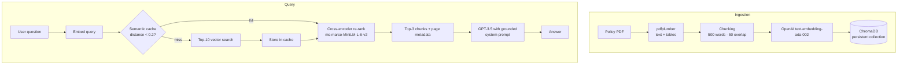

# 🛡️ HelpMate AI — RAG Chatbot for Insurance Policy Documents


> A **Retrieval-Augmented Generation (RAG)** system that answers questions about a **64-page life-insurance policy** — with a semantic cache, cross-encoder re-ranking and a prompt that **refuses to answer when the policy doesn't contain the information**.

---

## 📌 Problem

Insurance policies are long, legalistic PDFs. Customers and support agents struggle to find answers to simple questions like *"What is the claim process?"* A plain LLM will answer confidently but may **hallucinate** terms that aren't in the policy.

**HelpMate AI** grounds every answer in the actual document text, and every retrieved chunk carries its page number so answers can be traced back to the source.

## 🏗️ Architecture



### The three layers

| Layer | What it does | Why |
|---|---|---|
| **1 · Embedding** | Extracts text *and tables* page-by-page, chunks with overlap, embeds with `text-embedding-ada-002`, stores with page metadata in ChromaDB | Overlap keeps clauses that span chunk boundaries intact; metadata enables citations |
| **2 · Search** | Checks a **semantic cache** first; on a miss, retrieves the top-10 chunks and **re-ranks them with a cross-encoder** | Cache cuts cost & latency for repeated questions; cross-encoders score (query, passage) pairs jointly and are far more precise than cosine similarity alone |
| **3 · Generation** | GPT-3.5 receives only the top-3 re-ranked chunks and a strict system prompt | Instructed to answer *only* from retrieved text and to say so when it can't |

## 🧪 Example Results

| Query | Behaviour |
|---|---|
| *"What is the claim process for nominees of the policy?"* | Step-by-step answer: written notice within 20 days, claim forms, proof of loss… — taken from the policy |
| *"Are there any exclusions under which benefits are not paid?"* | Lists disqualification conditions and contingent-beneficiary rules from the policy |
| *"How is the policy surrender value calculated?"* | **Declines** — *the retrieved content does not cover surrender value* — instead of inventing a formula ✅ |

The third case is the most important: it shows the grounding prompt **prevents hallucination**. Screenshots of the search-layer and generation-layer outputs for each query are included in the repo.

## 🧠 Design Decisions & Learnings

- **Chunk size / overlap** trade-off: larger chunks keep context, smaller chunks improve retrieval precision; 500 words with 50-word overlap worked well for policy clauses.
- **Two-stage retrieval** (fast bi-encoder recall → accurate cross-encoder precision) is a standard production RAG pattern.
- **Caching at the semantic level** (not exact string match) catches paraphrased repeat questions.
- The **system prompt is a safety feature**, not just formatting.

## 🔭 Next Steps

- Evaluate retrieval with a labelled question set (hit-rate, MRR) and answers with RAGAS-style faithfulness scores.
- Add a Streamlit / Gradio front-end and support for multiple policy documents.
- Swap in open-source embeddings and LLMs for on-premise deployments.

## 🚀 How to Run

```bash
git clone https://github.com/AnishRane-cox/Insurance-HelpMateAI.git
cd Insurance-HelpMateAI
pip install openai chromadb pdfplumber PyPDF2 sentence-transformers nltk pandas
export OPENAI_API_KEY="your-api-key"
jupyter notebook Insurance_HelpMate_AI.ipynb
```

The notebook was built in Google Colab — update the Drive paths in the first cells (or point them to the repo folder) and supply your key via environment variable.

## 📁 Repository Structure

```
├── Insurance_HelpMate_AI.ipynb                 # Full RAG pipeline
├── Principal-Sample-Life-Insurance-Policy.pdf  # Source document
├── ChromaDB_presistpath_Chuncking/             # Persisted vector store
├── Top_3_from_the_Search_Layer_Query_*.png     # Retrieval results (3 test queries)
├── Final_Generated_Answer_*_Query_*.png        # Generated answers
├── RAG_Insurance_Chatbot_Documentation.pdf     # Project report
└── LICENSE
```

---

## 👤 Author

**Anish Rane** — Data & AI Engineer · MSc Machine Learning & AI (LJMU) · Mechanical Engineer

[](https://anishrane-cox.github.io/Portfolio/)
[](https://www.linkedin.com/in/anish-rane/)
[](https://github.com/AnishRane-cox)

⭐ If you found this useful, consider starring the repo.
